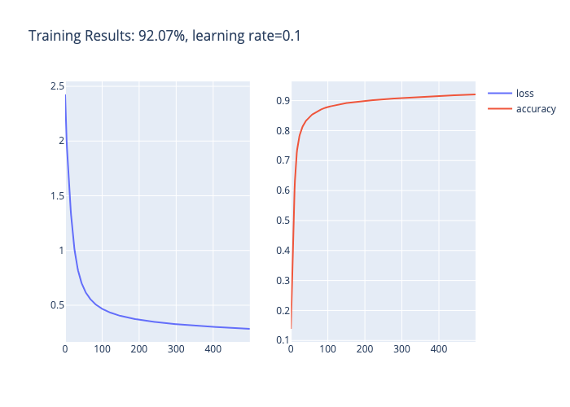

# NumpyNet: Neural Network from Scratch

The motivation behind building numpynet is to obtain a deeper understanding of neural network intuition and the math behind forward and backward propagation.

## Initialize Parameters
Network dimensions:  
$$ n^{[0]} = 784 $$
$$ n^{[1]} =  64 $$
$$ n^{[2]} = 10 $$

Initialize $W^{[l]}$ with He initialization and $b^{[l]}$ as zeros:
$$W^{[l]} = np.random.randn(n^{[l]}, n^{[l -1]}) \times \sqrt{\frac{2}{n^{[l-1]}}}$$
$$b^{[l]} = np.zeros(n^{[l]}, 1) $$
## Activation Functions
$ReLU$
$$
\mathrm{\sigma^{[l]}}(x) =  \begin{cases} 
    0 & if\;  x < 0 \\
    x & if\; x \geq 0
    \end{cases} \qquad \qquad
 \mathrm{\sigma^{\prime{[l]}}}(x) =  \begin{cases} 
    0 & if\;  x < 0 \\
    x & if\; x \geq 0
    \end{cases}$$
$Softmax$
$$ 
\sigma^{[L]}(x) = \frac{e^x}{\sum e^x} $$

## Forward Propagation

$$
Z^{[l]} = W^{[l]} A^{[l-1]} + b^{[l]}  
$$ 
$$
A^{[l]} = \sigma^{[l]}(Z^{[l]}) 
$$
$$ . . . $$
$$
A^{[L]} = \sigma^{[L]}(Z^{[L]}) = \hat{Y}
$$
## Back Propagation
$$dZ^{[L]} = A^{[L]} - Y$$
$$ dW^{[L]} = \frac{1}{m}dZ^{[L]}A^{[L]^T}$$
$$ db^{[L]} = \frac{1}{m}\sum dZ^{[L]} $$
$$ dZ^{[L - 1]} = dW^{[L]^T}dZ^{[L]}\sigma^{\prime{[L]}}(Z^{[L-1]})$$
$$ ...$$
$$dZ^{[1]} = dW^{[1]^T}dZ^{[2]}\sigma^{\prime{[1]}}(Z^{[1]})$$
$$dW^{[1]} = \frac{1}{m}dZ^{1}A^{[1]^T}$$
$$db^{[1]} = \frac{1}{m}\sum dZ^{[1]}$$ 
## Update Parameters
$$W^{[l]} = W^{[l]} - \eta \, dW^{[l]} $$
$$b^{[l]} = b^{[l]} - \eta \, db^{[l]} $$

## Training Results

## Model Accuracy on Test Set: 